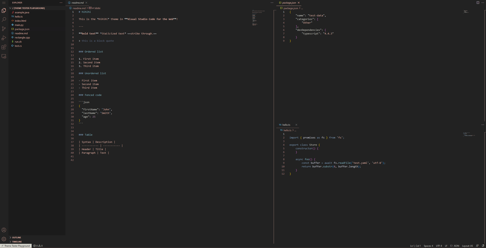

  <h1>
    

hihihi for VSCode

  </h1>
  <h3>Born out of a love for rose gold. Modern. Classic. Iconic. For you.</h3>
   

---

A clean Visual Studio code theme that celebrates the lights of rose gold, inspired on GMK Olivia++ keycaps.

## Color Palette

| Color&nbsp;&nbsp;&nbsp;&nbsp;&nbsp;&nbsp;&nbsp;&nbsp;&nbsp;&nbsp;&nbsp;&nbsp;&nbsp;&nbsp;&nbsp; | Use                                                                                                                     |
| ----------------------------------------------------------------------------------------------- | ----------------------------------------------------------------------------------------------------------------------- |
|  `#f1beb0`                       | This keyword, HTML elements, Regex group symbol, CSS units, Terminal Red                                                |
|  `#ff9e64`                       | Number and Boolean constants, Language support constants                                                                |
|  `#e0af68`                       | Function parameters, Regex character sets, Terminal Yellow                                                              |
|  `#f1beb0`                       | Strings, CSS class names                                                                                                |
|  `#73daca`                       | Object literal keys, Markdown links, Terminal Green                                                                     |
|  `#b4f9f8`                       | Regex literal strings                                                                                                   |
|  `#2ac3de`                       | Language support functions, CSS HTML elements                                                                           |
|  `#7dcfff`                       | Object properties, Regex quantifiers and flags, Markdown headings, Terminal Cyan, Markdown code, Import/export keywords |
|  `#7aa2f7`                       | Function names, CSS property names, Terminal Blue                                                                       |
|  `#bb9af7`                       | Control Keywords, Storage Types, Regex symbols and operators, HTML Attributes, Terminal Magenta                         |
|  `#c0caf5`                       | Variables, Class names, Terminal White                                                                                  |
|  `#a9b1d6`                       | Editor Foreground                                                                                                       |
|  `#9aa5ce`                       | Markdown Text, HTML Text                                                                                                |
|  `#cfc9c2`                       | Parameters inside functions (semantic highlighting only)                                                                |
|  `#565f89`                       | Comments                                                                                                                |
|  `#414868`                       | Terminal                                                                                                                |
|  `#24283b`                       | Editor                                                                                                                  |

## Thanks

❤ Special thanks ️to:️

- [Cobalt2 Theme Official](https://marketplace.visualstudio.com/items?itemName=wesbos.theme-cobalt2)
- [Nord](https://marketplace.visualstudio.com/items?itemName=arcticicestudio.nord-visual-studio-code)

**Enjoy!**

---

hihihi theme icon was made using logo.com, and color palettes in this README use placeholder.com.

